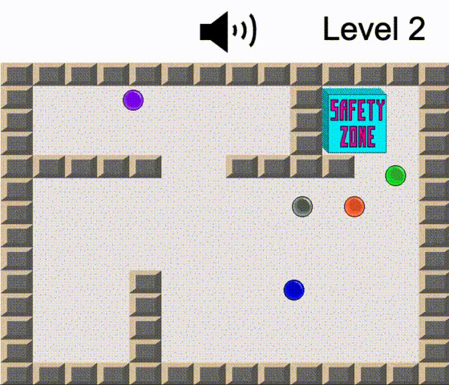

# Melody Collider
<p align="center">
    <a href="https://umnum.github.io/MelodyCollider" target="_blank">
        
    </a>
</p>
An online game based on collecting melodies. Implemented almost entirely in Vanilla Javascript, with visual rendering done in Canvas API, audio processing done in Tone.js, and keyboard event handling done in keymaster.js.

[play Melody Collider](https://umnum.github.io/MelodyCollider)

## Gameplay

Colorful music orbs collide with each other inside of a grid. Each orb is associated with their own color and musical note. At the beginning of each level, these orbs play together in sequence, forming a melody. You will navigate this grid as a gray orb, collecting the melody in the sequence it was played. Avoid colliding with the wrong orbs, which will bring your melody out of sequence. Safety Zones are provided for you to shelter you from colliding with other orbs, as well as giving you the ability to trigger the melody sequence you have collected so far, followed by the remaining melody you must collect. Collecting the full melody advances you to the next level.

## Implementation

### Game Rendering

The `GameView` class determines which part of the game will be rendered at a given time. The `start()` function begins the process of running a new game: 

``` javascript
// game_view.js

GameView.prototype.start = function () {
    window.setInterval(this.renderGame.bind(this), 20);
    this.bindKeyHandlers(this.game);
    this.game.menuStart();
};
```

`setInterval()` calls the function `renderGame()` to render the game at a refresh rate of 50fps. The `Game` class contains flags which keep track of the various states of the game, conditional statements within `renderGame()` will utilize these flags to determine which aspect of the game will be rendered.

```javascript
// game_view.js

GameView.prototype.renderGame = function (e) {
    if (this.game.isPlayingMenuScreen()) {
        this.game.playMenuScreen(this.menuCtx);
    }
    else {
        if (this.game.isGamePaused()) {
            this.game.playPauseScreen(this.pauseCtx);
        }
        else { // at this point, gameplay is rendered
            this.game.drawGrid(this.gridCtx, 'level ' + this.game.currentLevel, this.headerCtx, this.audioCtx);
            this.game.drawSafetyZone(this.safetyZoneCtx, this.instructionsCtx, 'level ' + this.game.currentLevel);
            if (!this.game.isWon) {
                this.game.drawHeader(this.headerCtx)
                this.game.drawAudioIcon(this.audioCtx);
            }
            if (this.game.isPlayingIntroSequence()) {
                this.game.playIntroSequence(this.gameCtx, 'level ' + this.game.currentLevel);
            }
            else { // can only play a melodic sequence inside of a Safety Zone
                if (this.game.isPlayingSequence()) {
                    this.game.playSequence(this.gameCtx, null);
                }
                // render all the moving parts of the game
                this.game.moveObjects(this.gridCtx, this.gameCtx, this.safetyZoneCtx);
                this.game.draw(this.gameCtx);
            }
        }
    }
};
```

`bindKeyHandlers()` uses the `key()` function from the `keymaster.js` library to listen to any keyboard event calls pertaining to the game, and responds with the appropriate asynchonous callback function: 

``` javascript
GameView.prototype.bindKeyHandlers = function (game) {
    let that = this;
    key('up', function () {game.player.direction('up')});
    key('down', function () {game.player.direction('down')});
    key('left', function () {game.player.direction('left')});
    key('right', function () {game.player.direction('right')});
    key('space', function () {if(game.player.isSafe) {game.isSequence = true}});
    key('up', function () {game.menuAction('up')});
    key('down', function () {game.menuAction('down')});
    key('left', function () {game.menuAction('left')});
    key('right', function () {game.menuAction('right')});
    key('enter', function () {game.menuAction('select', that.menuCtx)});
    key('left', function () {game.pauseAction('left')});
    key('right', function () {game.pauseAction('right')});
    key('enter', function () {game.pauseAction('select', that.pauseCtx, that.gameCtx, that.headerCtx, that.gridCtx, that.safetyZoneCtx, that.instructionsCtx, that.audioCtx)});
    key('m', function () {game.toggleAudio()});
}
```

`GameView` then calls `Game`'s `menuStart()` function to toggle the `isMenu` flag to `true`. This begins the process of rendering the title screen menu:

``` javascript
Game.prototype.menuStart = function () {
    this.isMenu = true;
}
```